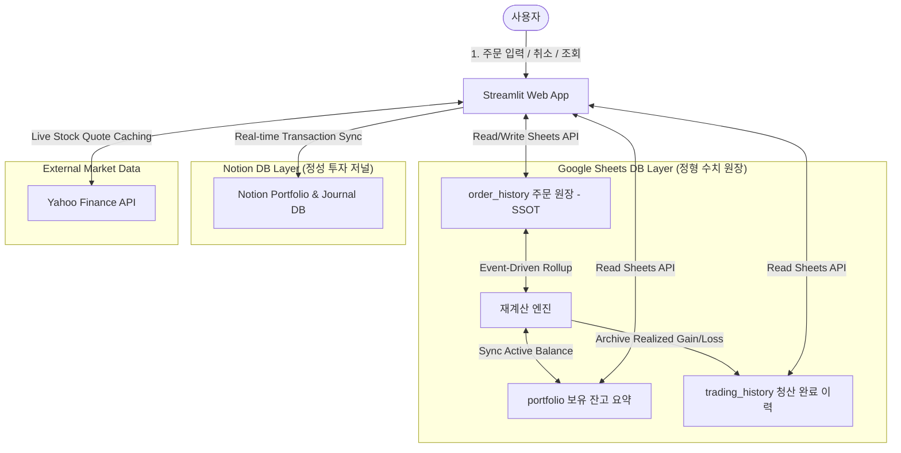

# 💰 배당 포트폴리오 모니터링 & 매매 저널 시스템

구글 스프레드시트와 노션(Notion) API를 연동하여 실시간 자산 현황을 모니터링하고, 투자 원칙 준수를 돕는 매매 복기 저널을 작성하는 **투자 관리용 Streamlit 웹 어플리케이션**입니다.

이 프로젝트는 데이터의 수치적 무결성을 보장하는 **DB 이원화(CQRS/이벤트 소싱) 설계**와, 줄글 일지 작성에 최적화된 **외부 저장소(Google Sheets & Notion) 하이브리드 연동**, 그리고 Streamlit의 동작 한계를 극복한 **Rerun 최소화 성능 최적화**가 적용되어 신뢰성 높은 투자 환경을 제공합니다.

---

## 🔗 Live Demo
* **배포 URL**: (개인 투자 기록 보호 및 외부인에 의한 데이터 오염을 방지하기 위해 데모 사이트는 비공개로 운영 중입니다)
* 본 서비스는 Google Sheets를 수치 원장 DB로, Notion을 매매 저널 저장소로 하이브리드 연동하여 작동합니다.

---

## 🛠️ 핵심 기능 (Core Features)

### 1. 투자 자산 모니터링 & 스크리닝 (V2 골격)
* **배당 포트폴리오 대시보드**: 현재 보유 중인 자산의 평가액, 수익률, 평균 진입 단가를 실시간 주가 반영 및 시각화(Plotly)를 통해 모니터링합니다.
* **배당주 Pool 및 관심종목 관리**: 시장의 다양한 배당주를 조건별로 탐색하고 관심종목으로 등록해 빠르게 분석할 수 있습니다.

### 2. 하이브리드 투자 저널 & 복기 (V3 골격)
* **포지션(Position) 단위 매매 그룹화**: 여러 번에 걸쳐 분할 진입/청산이 일어나는 거래를 하나의 '포지션 수명 주기'로 묶어 관리합니다.
* **수치 & 정성 저널의 하이브리드 통합**: 
  * 계량적 원장은 구글 시트에 안전하게 보관하며, 정성적 복기(진입 판단 근거, 심리 상태 태그, 최종 반성문 등)는 가독성과 자유도가 뛰어난 노션 저널 DB에 실시간 연동 및 자동 마감합니다.
* **주문 개별 취소 및 평단가 자가 치유**: 잘못 기입된 체결 건을 개별 취소하면 전체 주문 역사를 역산 롤백하여 평단가와 잔고를 정상 상태로 자동 복원합니다.

---

## 📐 시스템 설계 및 아키텍처

### System Architecture


### 1. CQRS 및 이벤트 소싱 기반의 데이터 정합성 (DB 이원화)
* **진실의 단일 원천(SSOT)**: 보유 잔고를 직접 덮어쓰지 않고, 불변의 거래 로그인 `order_history`(주문 원장)만 쓰기 채널(Command)로 삼습니다.
* **이벤트 소싱**: 잔고 테이블인 `portfolio`와 실현 이력 `trading_history`는 원장 데이터를 시간순으로 처음부터 재생 및 집계하여 도출하는 읽기 채널(Query) 뷰로 격리 구현했습니다.
* **조인 무결성**: 다중 분할 매매 상태에서도 데이터가 꼬이지 않도록 관계형 식별 키인 `position_id`를 도입했습니다.

### 2. 개인화 인터랙션 랙 해소를 위한 Rerun 최소화
* 관심종목 등록, 포지션 추가/청산, 모달 조작 등 개인화 인터랙션이 추가됨에 따라 화면 전체가 새로 렌더링되던 Streamlit의 병목을 해결했습니다.
* **st.fragment 부분 렌더링**: 무거운 Plotly 차트 레이아웃 등과 입력 폼 영역을 분리 격리하여 조작 시 Rerun 단위를 "부분"으로 격리하고 불필요한 차트 재렌더링 부하를 0%로 만들었습니다.
* **정밀 캐시 무효화 (Fine-grained Invalidation)**: 캐시 파괴 범위를 핀포인트로 조준 만료하여 불필요한 야후 파이낸스(`yfinance`) 주가 데이터 재다운로드 로딩 현상을 제거했습니다.

---

## 🚀 로컬 실행 및 테스트 방법

### 1. 가상환경 구축 및 패키지 설치
```bash
pip install -r requirements.txt
```

### 2. 환경 변수 설정
로컬 루트 디렉토리에 `.env` 파일을 생성하고 Google Sheets API 자격증명 및 Notion API Key를 설정합니다.

### 3. 웹 어플리케이션 구동
```bash
streamlit run app.py
```

### 4. ⚙️ [관리자 도구] 테스트 데이터 완전 초기화
```bash
python reset_all_data.py
```
