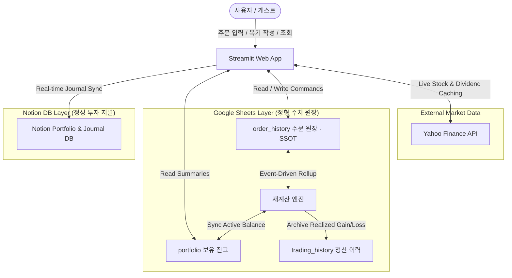

# 💰 fn-web: 미국 배당주 개인 투자 관리 도구

[](https://gaqu-stock.streamlit.app)
[]()

### 💡 Project Overview
* 🎯 **개발 목적**: 실제 미국 배당주 투자를 진행하며 느낀 불편함을 해결하기 위해 자체 구축한 개인용 도구
* 🔑 **핵심 기능**: 과거 **배당수익률 조회**, **배당주 풀/관심종목/포트폴리오 관리**, **매매 복기 저널** 등

---

## 🌐 Live Interactive Demo & Sandbox Mode

본 서비스는 누구나 자유롭게 모의 매매 및 투자 관리 기능을 체험해 볼 수 있도록 **게스트(샌드박스) 모드**를 기본 제공합니다.

* 🔗 **라이브 데모 바로가기**: [https://gaqu-stock.streamlit.app](https://gaqu-stock.streamlit.app)
* 🔒 **게스트 샌드박스 모드**: 접속 시 로그인 없이 가상 데이터 샌드박스로 구동되며, 관리자의 실제 구글 시트/노션 원장은 안전하게 보호됩니다.

---

## 🎯 1. 기획 배경 & 문제 정의 (Value-Driven Planning)

본 프로젝트는 **"개인 투자 과정에서 직접 경험한 페인 포인트"**를 명확한 문제로 정의하고, 실질적인 가치를 창출하는 데에서 출발했습니다.

| 구분 | 🛑 기존 페인 포인트 (Pain Points) | 💡 fn-web의 해결책 (Value Delivered) |
| :--- | :--- | :--- |
| **지표의 부재** | 배당주 투자의 핵심 지표인 **과거 배당수익률 추이**를 한눈에 볼 수 있는 무료 서비스 부재 | 과거 시점별 배당수익률 직접 산출 및 **반응형 Plotly 차트 시각화** 구현 |
| **환경 종속성** | Jupyter Notebook 기반 로컬 스크립트로 동작하여 무거운 노트북 소지 필수 | 어디서나 접속 가능한 **Streamlit Cloud 기반 웹 서비스**로 전환 |
| **조작/시각화 불편** | 매번 코드를 실행해 결과 확인, 기간 설정 및 필터링 불가능 | 기간 선택, 종목 검색, 필터링, 차트 확대/축소를 지원하는 **반응형 UI/UX** |
| **종목 관리 한계** | 관심 배당주를 일일이 수동 입력하여 개별 조회 | 배당주 Pool 스크리닝 및 **관심종목 찜하기/개인화 관리** 기능 도입 |
| **복기 체계 부재** | 매매 수치 기록과 당시의 정성적 투자 근거/복기가 파편화됨 | **Google Sheets(수치 원장)** + **Notion(정성 저널)** 하이브리드 자동 동기화 |

---

## 🏗️ 2. 전략적 도구 조합 (Orchestration & Lean Tech Stack)

**문제 해결에 필요한 최소한의 & 최적의 도구(Lean & Smart Tooling)**를 오케스트레이션하여 **서버 유지 비용 0원**과 개발 효율성 극대화를 달성했습니다.

```
[Streamlit Cloud] ── (웹 UI & 반응형 인터랙션)
       │
       ├── [yfinance] ────────── (실시간/과거 주가 & 배당 시계열 수집)
       ├── [Google Sheets] ───── (수치 원장 DB / CQRS SSOT 원장)
       └── [Notion API] ──────── (정성적 매매일지 & 투자 복기 저널)
```

* **Market Data Engine (`yfinance`)**: 과거 주가 대비 배당금 추이를 역산하여 시계열 배당수익률 데이터 파이프라인 형성.
* **Quantitative DB (`Google Sheets API`)**: 별도 서버 DB(PostgreSQL/MySQL 등) 구축/운영 비용 없이 수치 무결성을 보장하는 **정형 수치 원장(SSOT)**으로 활용.
* **Qualitative Journaling System (`Notion API`)**: 줄글 복기, 심리 상태 태그, 진입 사유 기록에 최적화된 리치 텍스트 저장소 역할 수행.
* **Application Layer (`Streamlit`)**: Python 스택만으로 빠르고 직관적인 반응형 금융 대시보드를 구축.

---

## 📈 3. 점진적 고도화 과정 (Agility & Iteration Roadmap)

우선순위(Priority)에 따라 단계를 나누고 지속적인 버전 관리를 통해 프로덕트를 점진적으로 고도화했습니다.

```
[V0: Local Script] ➔ [V1: Web Dashboard] ➔ [V2: Personalization] ➔ [V3: System Integrity & Journal]
```

* **V0 (로컬 분석 스크립트)**: Jupyter Notebook에서 야후 파이낸스 데이터를 활용한 과거 배당수익률 계산 및 그래프 생성 스크립트 검증.
* **V1 (웹 대시보드 전환)**: Streamlit Web App으로 전환하여 공간 제약 없이 어디서나 웹 브라우저로 접근 가능한 대시보드 구축.
* **V2 (사용자 개인화 및 데이터 확장)**: 배당주 Pool 탐색, 조건별 스크리닝 및 관심종목 등록/관리 UI 도입.
* **V3 (원장 정합성 및 매매 복기 고도화)** *(Current)*:
  - **CQRS / 이벤트 소싱** 기반 Google Sheets DB 이원화 (`order_history` SSOT 연동 및 평단가 자가 치유).
  - **Notion 매매일지(복기)** 연동 및 포지션 단위 그룹화.

---

## 📐 4. 핵심 기술 및 시스템 설계 (Technical Highlights)

### System Architecture

```mermaid
graph TD
    User([사용자 / 게스트]) -->|주문 입력 / 복기 작성 / 조회| WebApp[Streamlit Web App]

    subgraph "External Market Data"
        YFinance[Yahoo Finance API]
    end

    subgraph "Google Sheets Layer (정형 수치 원장)"
        OrderHistory[order_history 주문 원장 - SSOT] <-->|Event-Driven Rollup| Recalc[재계산 엔진]
        Recalc <-->|Sync Active Balance| Portfolio[portfolio 보유 잔고]
        Recalc -->|Archive Realized Gain/Loss| TradingHistory[trading_history 청산 이력]
    end

    subgraph "Notion DB Layer (정성 투자 저널)"
        NotionJournal[Notion Portfolio & Journal DB]
    end

    WebApp <-->|Live Stock & Dividend Caching| YFinance
    WebApp <-->|Read / Write Commands| OrderHistory
    WebApp <-->|Read Summaries| Portfolio
    WebApp -->|Real-time Journal Sync| NotionJournal
```

### Key Technical Achievements
1. **CQRS & 이벤트 소싱 기반 수치 정합성 보장**
   - **쓰기/조회 분리 (CQRS)**: 보유 잔고를 직접 덮어쓰지 않고, 수정 불가능한 거래 원장(`order_history`)에만 주문을 순차적으로 기입.
   - **이력 재생 및 복원 (이벤트 소싱)**: 잘못 기입된 체결 건을 취소하면 과거 거래 로그 전체를 처음부터 전수 재계산하여 평단가와 잔고를 자동 치유(Self-Healing).
2. **Streamlit Rerun 성능 병목 최적화**
   - `st.fragment`를 도입하여 대용량 Plotly 차트 영역과 옵션 조작 영역의 Rerun 스코프를 격리 차단 (불필요한 차트 재렌더링 부하 0% 달성).
   - 정밀 캐시 무효화(Fine-grained Invalidation)로 `yfinance` 주가 데이터 불필요 재다운로드 병목 제거.

---

## ⚡ 5. 빠른 실행 및 개발자 가이드 (Quick Start & Setup)

### 로컬 모의 구동 (Quick Run)
```bash
git clone https://github.com/lazqu/fn-web.git
cd fn-web
pip install -r requirements.txt
streamlit run app.py
```

> 📖 **GCP 서비스 계정 발급, Notion DB 속성 스키마 및 secrets.toml 연동에 관한 가이드**는 **[DEVELOPER_GUIDE.md](DEVELOPER_GUIDE.md)**를 참조하세요.

---

## 📄 License & Contact
- **Author**: lazqu
- **Repository**: [https://github.com/lazqu/fn-web](https://github.com/lazqu/fn-web)
